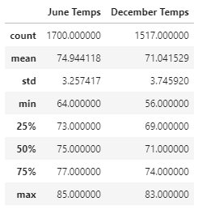

# SurfsUP Challenge
## Project overview: 
Following the analysis of weather data reported by stations in Oahu, Hawaii, investor W.Avy requested further analysis of temperature data for the months of June and December.The findings below indicate that the surf and ice-cream shop business is sustainable throughout the year.

## Results: 
Below is the table that provides the statistics for the temperatures recorded in Oahu in the months of June and December. The data includes temperatures recorded from 2010 until 2017.

### Summary Statistics for June and December: 

### Key findings: 
1. There are fewer records of temperature in December compared to June, which is demonstrated by the 'count' row on the table above. 
2. All the metrics apart from minimum temperatures show differences at similar rates (3-4 degrees), while the mininum recorded temperature in December is lower than June's minimum by 8 degrees.
3. Percentiles demonstrated that half of the data in each month differ from one another by 4 degrees.

## Summary: 
Findings demonstrate that, overall, the difference in metrics between June and December allows the to run a sustainable shop business in Oahu. Analysis could be enhanced with additional queries suggested below and further analysis to match days when the temperatures are low AND precipitation is high:

  1. Get the days in December when the temperature is below the minimum recorded in June: 
  `dec_min_count = session.query(Measurement.date, Measurement.tobs).filter(extract('month', Measurement.date) == 12).filter(Measurement.tobs <= 64).order_by(Measurement.date.desc()).all()`
  2. Get the days in December when precipitation was above 0: 
  `prcp_december = session.query(Measurement.date, Measurement.prcp).filter(extract('month', Measurement.date) == 12).filter(Measurement.prcp > 0).order_by(Measurement.date.desc()).all()`
